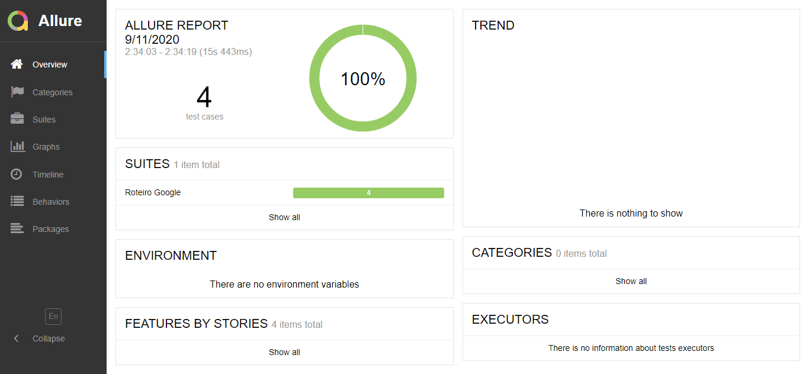

<h2 align="center">:robot:Cypress-Allure :bar_chart:</h2>

<!-- Index session-->
<p align="center">
 <a href="#-sobre-o-projeto">Sobre</a> •
 <a href="#-funcionalidades">Funcionalidades</a> • 
 <a href="#-como-executar-o-projeto">Executando</a> • 
 <a href="#-tecnologias">Tecnologias</a> • 
 <a href="#-licença">Licença</a>
</p>

<!--About session--> 
<a id="user-content--sobre-o-projeto" class="anchor" aria-hidden="true" href="#-sobre-o-projeto">
<h2>:page_with_curl: Sobre o projeto</h2>
</a>
 
Projeto desenvolvido com ênfase em aprendizado de automação de testes com Cypress e geração de relatórios utilizando Allure.<br>
Me foi proposto durante um processo seletivo a criar um roteiro de testes, automatizá-los e a gerar relatórios destes utilizando o framework
[Cypress](https://www.cypress.io/). O [Cypress](https://www.cypress.io/) é um framework open source de automação de testes end to end.
Já o [Allure](http://allure.qatools.ru/) é outro framework open source que gera e exibe relatórios de testes.

---

<!--Functionalities session-->
<a id="user-content--funcionalidades" class="anchor" aria-hidden="true" href="#-sobre-o-projeto">
<h2>:gear: Funcionalidades</h2>
</a>
<p>Eu realizei a escrita de 4 testes básicos realizados no site de pesquisa do Google, os seguintes comandos são os seguintes na ordem:</p>

  - [x] Uma pesquisa pelo botão "Pesquisar Google"
  - [x] Uma pesquisa pelo botão "Estou com sorte"
  - [x] Acessar um dos links dos resultados da busca
  - [x] Avançar a página de resultados para a próxima

---

<!--Running session-->
<a id="user-content--como-executar-o-projeto" class="anchor" aria-hidden="true" href="#-como-executar-o-projeto">
<h2>:computer: Como executar o projeto</h2>
</a>

### Pré-requisitos

* [Java 8](https://www.oracle.com/java/technologies/javase-jre8-downloads.html)
* [Git](https://git-scm.com)
* [Node.js](https://nodejs.org/en/)

### Configurando o ambiente do projeto
```bash
# Clone o repositório:
$ git clone https://github.com/Markoae/Cypress-Allure.git

# Acesse a pasta do projeto no prompt de comando de sua preferência:
$ cd Cypress-Allure

# Instale as dependências do projeto:
$ npm install

# Terminado de instalar as dependências está pronto o ambiente do projeto!
```

Após ter configurado o ambiente do projeto, abra o mesmo em seu editor de código de preferência e teremos as seguintes opções:

* Executar os testes com o Cypress para visualização
* Executar a opção de mostrar os relatórios dos testes executados através do Allure

Aqui vai os seguintes passos para executar cada uma das opções:

* ####  Executar os testes com Cypress para visualização

Para executar os testes com o framework do Cypress é bastante simples. Você acionara um script chamado "cypress" da seguinte forma:
```bash
#Comando que executará os testes no framework do Cypress:
$ npm run cypress
```

Após ser executado o comando, uma nova janela irá abrir igual a imagem a seguir:
<p align="center">

</p>
Para executar os testes é só clicar na opção "Run all specs" ou em cima do link "roteiro.spec.js" que é o arquivo que contém os testes em JavaScript.
Após isso, o Cypress irá abrir o browser e executar os testes na ordem descrita aqui anteriormente.


* ####  Executar a opção de mostrar os relatórios dos testes executados através do Allure

Para mostrar os relatórios dos testes com o framework Allure é bastante simples. Você acionara um comando da seguinte forma:
```bash
#Comando que mostra os relatórios dos testes no framework do Allure:
$ npx allure open allure-report
```
Após ser executado o comando, uma nova janela irá abrir igual a imagem a seguir:
<p align="center">

</p>

Na imagem acima é o modelo de como será exibido o relatório através de um browser iniciado pelo Allure após a execução do comando.

---

<!--Tecnologies session-->
<a id="user-content--tecnologias" class="anchor" aria-hidden="true" href="#-tecnologias">
<h2>🛠 Tecnologias</h2>
</a>


As tecnologias usadas no projeto foram as seguintes:

* [Cypress](https://www.cypress.io/)
* [Allure](http://allure.qatools.ru/)
* [Node.js](https://nodejs.org/en/)
* [Git](https://git-scm.com)

#### **Utilitários**

-   Editor:  **[Visual Studio Code](https://code.visualstudio.com/)** 


---

<!--License session-->
<a id="user-content--licença" class="anchor" aria-hidden="true" href="#-licença">
<h2>📝 Licença</h2>
</a>

Este projeto está sob a licença [MIT](./LICENSE).

---


